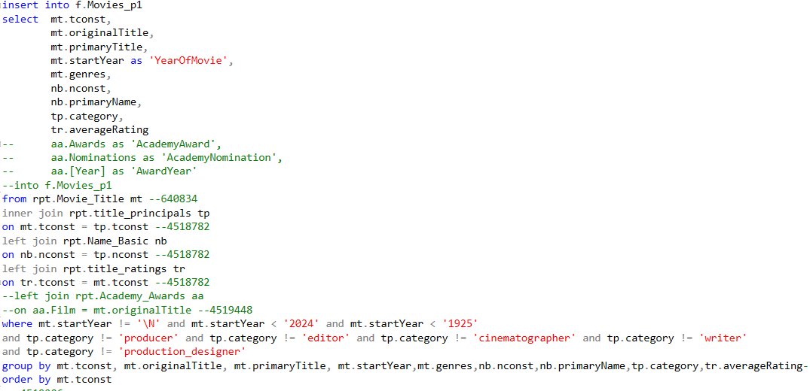

# **Why Does My Grandmother Buy Her Movies?** :movie_camera:

# **Updated Status of Project** :movie_camera:

_**EDA in Jupyter**_: 

In the following notebook you can see that I began with files in TSV from the [IMDB dataset](https://www.imdb.com/interfaces/) and converted them to CSVs in a file for each of the notebooks. The notebooks are available in the files above. During that process I used a separate notebook titled EDA2 and did some initial removing of columns that were not needed for the transition to SSMS in order to save on memory space. I also used a Notebook titled EDA to look at initial specifics of files and to get an idea of what the files looked like. I decided to only analyze feature films and therefore specified that the title_basics CSV only have the 'movie' titleType. This narrowed the dataset down to 640834

.

Once I had figured out what columns would be needed and had removed the ones I wouldn't need, I created the final CSVs that were ready to be imported to SSMS.

_**SSMS Stage**_: 

Once the CSVs were imported to the database, I used the created tables to look at the data and figure out what I would need for analysis. I began to explore the data and created a table to use when recording the movies my grandmother owns. Once I started exploring the data more, I realized that I excluded too many datapoints from my new table.

 

I hadn't realized my grandmother had movies that were released prior to 1925.Therefore, I made a copy of the CSV I created from Jupyter and named it. 

The next step was the longest part of the process thus far. I had to go through my grandmother's movies individually to figure out what movie they were in the database. At the point I had to enter the data, I didn't have a star schema prepared yet but I found a way around this so I could create the dataset I was looking for.

I began by searching for the movie in the CSV 

. 

And if the movie wasn't identifiable as the movie in the search by either the title or the year, I would use the tconst column value to check in the larger database and find the film by actor and/or director 

.

If I still couldn't find the movie, I would check in the even larger file within Notepad++ to see if the movie was a made-for-TV movie or a TV show. If it was any form of media besides a feature film, I excluded it from the database. To indicate that a movie was in the collection, I placed a 1 in the column GMovies.

_**Creation of Dimensions within SSIS**_:

I created the SQL code for the following dimensions: 
- Category: indicating what position a person played in a film, such as actor, director etc. 
- Genres: The dataset initially had all the genres applicable to a movie listed in one place. I used a case statement to separate them into values of 1 and 0 to indicate whether that genre was used in a particular movie.
- Movie: This table has all 556 movies in my grandmother's movie collection listed with the tconst column to connect them to the other dimensions
- Names: This table has all 12 million plus names that were available in the original dataset as I didn't want to accidentally exclude a name that might be connected to a movie in the Movie table. I decided to keep the table as it was when I first imported it to SSMS as all the columns were relevant to the dimension.

I have also been setting up a project within SSIS so that my method of creating the star schema is repeatable and I can organize my progress as I go.

_**Next Steps**_:
1. My next step is to complete the dimension table for the Academy Awards.
2. After this is complete, I plan to create the Fact Table. In the fact table I intend to include the movie ratings as a field of it's own because I don't feel it needs it's own dimension table. 
3. Once I have the fact table ready to go, I have a template for PowerBI ready for the star schema. I have already planned out my presentation of the information within PowerBI.
4. I am hoping to have my star schema ready by tomorrow afternoon and to be working on the visualizations.

# First Draft Info
### **1. Introduction**
This project will outline the aspects of film that influence whether or not my grandmother will purchase a physical copy of a movie. I will do this by taking a dataset of IMDB's movie database, which is updated quarterly, and comparing it to the physical copies of movies in my grandmother's basement.

### **2. Use**
This visualization set will be able to show what aspects of movies would be most likely to influence the purchasing behaviour of one consumer (my grandmother) specifically. A similar methodology could be applied to other specific consumers to see what the strongest influences are on those other consumers.

### **3. Objective or Concept**
Part of the objective of this visualization will be to help my grandmother better understand her preferences in movies and part of it will be to create an accessible template for analyzing consumer taste in movies. I'm going to create a transferable template for inputting a consumer's movie collection or viewing history to give them a visual way to assess and understand their own preferences in movies.

### **4. Problem Statement**
My grandmother has a lot of movies in her basement and up until now has only been able to organize her movies collection by sorting them alphabetically and writing down what movies she buys in a notebook that she's had for years. I want to create a database that I can quickly look up for her if she has a movie already. From this database, I want to be able to give her a visualization of her collection and a breakdown of what aspects of those movies will determine if she purchases it or not. In creating this database and visualization for my grandmother, I am also making a template that I can use in the future for consumer movie purchasing behaviour.

### **5. Data:**

- I am using the [IMDB dataset](https://www.imdb.com/interfaces/) from the IMDB website for the primary dataset to retrieve the basic movie information. 

- I have created a column within the dataset to indicate if my grandmother has a movie or not. I have created this column to represent only feature films so this column does not include made-for-tv movies or television shows. 

- I will also be adding onto the dataset if a movie has won an [Academy Award](https://en.wikipedia.org/wiki/List_of_Academy_Award-winning_films) retrieved from Wikipedia.

### **6. Use Case**

My visualization is a very consumer specific idea that will assess the individual person's preferences and help them to understand their own purchasing behaviour better.

### **7. Scope**
    
- I am going to clean up the original IMDB dataset and the Academy Awards dataset using both PANDAS, JUPYTER notebooks, SSIS in Visual Studio and then finally in SSMS. 
- My goal is to do the initial exploratory data analysis and combining of the three datasets within PANDAS, save the full dataset into a CSV. 
- I haven't yet determined if I wish to use SSIS in between EDA and SQL. 
- After the preparation of the datasets, I will add a column at the end that will indicate whether my grandmother has the movie in her collection using binary values of 1 and 0.
- Once all the data is prepared, I will create a star schema using SSIS. I want to create a visualization using either PowerBI or Tableau. I haven't determined if I want to try a new program for visualization or really focus on PowerBI.

